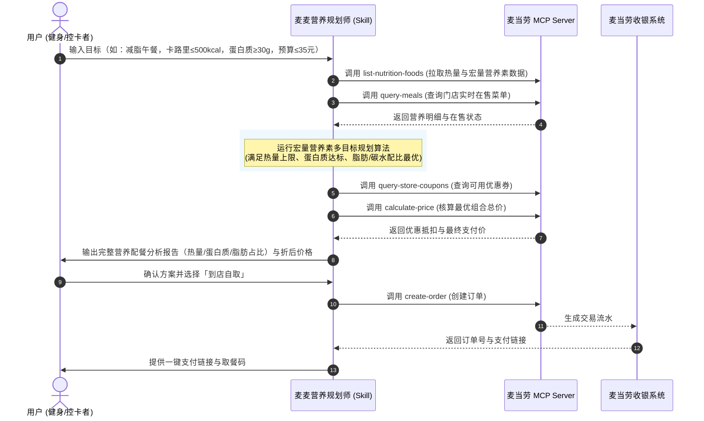

# 麦当劳 MCP 集成说明 (MCP Integration)

本项目作为「麦当劳程序员创意开发大赛」参赛作品，深度基于麦当劳中国官方提供的 Model Context Protocol (MCP) 能力构建。

---

## 一、 MCP Server 接入规范

- **官方接入地址**：`https://mcp.mcd.cn`
- **传输协议**：`Streamable HTTP`
- **鉴权方式**：HTTP 请求头携带 `Authorization: Bearer YOUR_MCP_TOKEN`
- **脱敏配置示例**：见项目根目录 [mcp-config.example.json](file:///C:/Users/Raylan/.gemini/antigravity/scratch/mcd-nutrition-planner/mcp-config.example.json)

---

## 二、 集成的 MCP 工具 (Tools) 列表

本项目将麦当劳官方开放的营养素底座、门店供给、优惠营销与点餐交易串联成完整闭环，核心使用的 Tools 包括：

| 序号 | MCP Tool 名称 | 接口功能与业务用途 | 本项目中调用时机与角色 |
|:---:|:---|:---|:---|
| 1 | `list-nutrition-foods` | 获取餐品营养成分数据（能量、蛋白质、脂肪、碳水化合物、钠、钙等） | **核心数据源**：输入热量/蛋白质/脂肪硬性约束时的评估基准 |
| 2 | `query-nearby-stores` | 查询用户附近的可用麦当劳餐厅 | 确定就餐门店与自提/外送履约点 |
| 3 | `query-meals` | 查询当前门店在售的餐品菜单及编码 | 过滤非在售餐品，确保推荐方案真实可点 |
| 4 | `query-meal-detail` | 查询餐品详情、套餐组成与可替换选项 | 针对减脂人群识别“可去沙拉酱”、“可换无糖茶饮/美式”的定制能力 |
| 5 | `query-store-coupons` | 查询用户当前门店下可用的优惠券 | 营养方案与省钱优惠联动，降低高蛋白餐食购买成本 |
| 6 | `calculate-price` | 根据选购商品列表计算实际应付总价 | 校验预算上限，输出折前折后对比明细 |
| 7 | `create-order` | 创建订单，返回订单详情与支付链接 | 完成从营养规划到就餐支付的最终业务闭环 |

---

## 三、 业务调用时序与执行链路

---

## 四、 核心业务价值

1. **打破“快餐不健康”刻板印象**：借助官方高公信力、高精度的营养素数据（`list-nutrition-foods`），为健美增肌、生酮控糖、减脂减重人群量身定制合规搭配。
2. **多目标约束满意求解**：不仅是单纯的卡路里相加，而是通过智能规划算法在“热量上限”、“蛋白质下限”、“预算成本”三者之间找到帕累托最优解。
3. **真实可落地的点餐闭环**：结合了在售状态校验、优惠券抵扣与一键生成订单，让创意真正解决用户的日常用餐决策。
