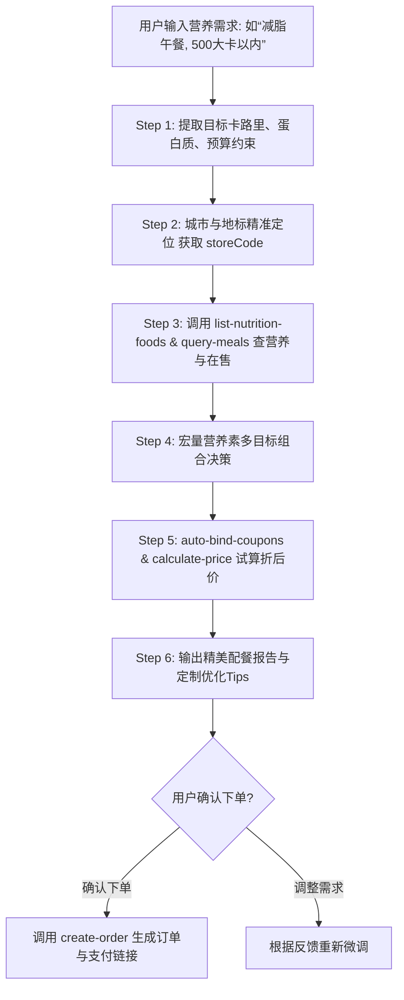

# 麦麦低卡/增肌营养规划师 (McD Nutrition Planner)

> 🍔 **麦当劳程序员创意开发大赛参赛作品 (1024 Programmers' Day Challenge)**  
> 基于麦当劳官方 Model Context Protocol (MCP) 原生能力与腾讯 WorkBuddy，打破“吃快餐=高热量负担”的传统认知，为控卡减脂、健身增肌与健康管理量身打造的智能营养配餐与闭环点餐 Skill。

[](https://github.com/rookit-ljt/mcd-nutrition-planner)
[](https://www.workbuddy.cn)
[](https://mcp.mcd.cn)
[](https://nodejs.org)
[](https://opensource.org/licenses/MIT)

---

## 📖 项目简介 (Overview)

在日常快餐消费中，健身增肌和减脂减重人群常面临三大痛点：
1. **热量与营养黑盒**：不清楚每份餐品的真实卡路里与宏量营养素配比；
2. **选择困难与单调**：为了控卡只能长期吃少数固定单品，容易产生饮食倦怠；
3. **价格与优惠脱节**：高蛋白单品组合往往价格偏高，缺乏与当前可用优惠券的高效联动；
4. **定位容易偏航**：传统盲目选店容易误选到异地或非营业中门店。

**「麦麦低卡/增肌营养规划师」** 深度编排麦当劳官方 MCP Server，直接对接权威的营养素基础数据库（`list-nutrition-foods`）与门店实时供给（`query-meals`），配合多目标规划算法与麦麦省优惠券抵扣，生成“高蛋白、控热量、省钱包”的最优解，并一键直连收银下单闭环。

---

## 🎯 目标用户群体 (Target Audience)

- **减脂控卡族**：严格控制单餐热量摄入（如 ≤ 500 kcal），追求高饱腹感与低油脂；
- **健身增肌族**：追求极高蛋白质摄入（如单餐 ≥ 35g 优质蛋白），注重蛋白热量密度；
- **控糖与生酮人群**：严格限制高升糖指数碳水，偏好优质肉类蛋白与纯膳食纤维；
- **都市职场白领**：工作日午餐需要健康快捷、预算明确且不纠结的确定性配餐。

---

## 🛠️ MCP 核心集成能力 (MCP Integration)

本项目深度串联麦当劳官方 8 大 MCP 原生工具，打通完整的业务执行闭环：

| MCP Tool | 工具名称 | 在本项目中的作用与业务价值 |
| :--- | :--- | :--- |
| `query-nearby-stores` | 查询附近门店 | **精准定位**：采用 `searchType=2` 按城市与商圈关键字定位，杜绝误选异地收藏店 |
| `delivery-query-addresses` | 外送收货地址 | 外送场景下获取用户的收货地址及 `addressId` |
| `delivery-query-stores` | 可配送门店查询 | 外送场景下根据 `addressId` 精准匹配能够送达的门店 |
| `list-nutrition-foods` | 餐品营养信息列表 | **核心底座**：获取能量(kcal)、蛋白质、脂肪、碳水、钠等官方权威指标 |
| `query-meals` | 在售餐品列表 | 结合所选门店的实时在售状态，确保推荐方案即时可买 |
| `query-meal-detail` | 餐品详情与替换 | 识别去沙拉酱（立减60kcal）、更换无糖黑咖啡等定制微调能力 |
| `auto-bind-coupons` | 麦麦省一键领券 | 自动领取当前所有可领优惠券，保证省钱最大化 |
| `query-store-coupons` | 门店可用优惠券 | 匹配门店支持的立减券与品类特惠，降低高蛋白餐品成本 |
| `calculate-price` | 商品价格计算 | 实时核算折前原价、优惠券抵扣与应付净额 |
| `create-order` | 创建订单 | 一键生成包含取餐码与安全支付链接的闭环订单 |

> 详细的系统架构图、调用时序及业务价值请查阅 [MCP_INTEGRATION.md](MCP_INTEGRATION.md)。

---

## 🔄 核心编排链路 (SOP Workflow)



---

## 🚀 两种使用方式 (Usage Guide)

### 方式一：在 WorkBuddy 中作为原生智能体使用（推荐·一句话点餐）

本项目核心以 [`SKILL.md`](SKILL.md) 形式编排，完美契合腾讯 WorkBuddy 官方智能体规范。

1. **配置 MCP**：在 WorkBuddy 的【专家·技能·连接器】➔【连接器】中配置麦当劳 MCP：
   ```json
   {
     "mcpServers": {
       "mcd-mcp": {
         "type": "streamablehttp",
         "url": "https://mcp.mcd.cn",
         "headers": {
           "Authorization": "Bearer YOUR_MCP_TOKEN"
         }
       }
     }
   }
   ```
2. **加载技能**：将本项目的 [`SKILL.md`](SKILL.md) 放入 WorkBuddy 技能目录：
   - 路径：`~/.workbuddy/skills/mcd-nutrition-planner/SKILL.md`
3. **自然语言对话体验**：
   在 WorkBuddy 对话框中直接输入：
   > *“今天练了胸肌，我在深圳科技园，帮我配一份热量不超过 600 大卡、蛋白质大于 35 克的麦当劳午餐，并帮我找出最省钱的搭配，最后生成自取订单。”*

WorkBuddy 的大模型将自动按照 SOP 顺序完成：精准定位 ➔ 查营养 ➔ 配餐 ➔ 算价 ➔ 输出卡片 ➔ 确认后下单！

---

### 方式二：命令行 CLI 独立运行（开发与离线测试）

本项目同时提供了开箱即用的原生 Node.js（零外部依赖）与 Python 脚本，自带官方脱敏离线数据库支持。

```bash
# 1. 克隆代码
git clone https://github.com/rookit-ljt/mcd-nutrition-planner.git
cd mcd-nutrition-planner

# 2. 运行减脂场景 (热量≤500kcal, 蛋白≥30g, 预算≤40元)
node index.js --goal fat-loss --max-calories 500 --min-protein 30

# 3. 运行增肌高蛋白场景 (热量≤800kcal, 蛋白≥45g)
node index.js --goal muscle-gain --max-calories 800 --min-protein 45

# 4. 触发下单闭环测试
node index.js --goal fat-loss --order
```

---

## 💻 运行输出效果展示 (Sample Output)

```text
============================================================
   🍔 麦麦低卡/增肌营养规划师 (McD Nutrition Planner) 🍔
   基于麦当劳官方 MCP 协议打造的智能营养配餐 Skill
============================================================

【📋 营养规划需求】
• 设定目标: 减脂控卡 (Fat Loss)
• 热量上限: ≤ 500 kcal  |  蛋白质目标: ≥ 30 g  |  预算上限: ≤ ¥40.00

【🥗 专属推荐餐单组合】
----------------------------------------------------------------------
餐品名称                        热量(kcal)      蛋白质(g)       脂肪(g) 单价
----------------------------------------------------------------------
麦麦脆汁鸡 (单块)                 286             19.5            18.2    ¥14.0
鲜蔬杯 (配低脂沙拉汁)             48              1.8             0.5     ¥12.0
纯牛奶 (纸盒装)                  130             6.8             7.0     ¥11.0
----------------------------------------------------------------------

【📊 宏量营养素全景】
🔥 总能量: 464 kcal (达成率: 92.8%)
🥩 蛋白质: 28.1 g (达标率: 93.7%)
🥑 脂肪:   25.7 g
🍞 碳水:   29.8 g
🧂 钠含量: 795 mg

【💰 MCP 算价与优惠明细】
• 门店菜单原价:   ¥37.00
• 麦麦省优惠抵扣: -¥5.00
• 实付结算金额:   ¥32.00

【💡 定制控卡优化秘笈】
  - 麦麦脆汁鸡 (单块)：鲜嫩多汁，去脆皮可减少约 8g 脂肪
  - 鲜蔬杯 (配低脂沙拉汁)：富含膳食纤维，近乎零脂肪负担
  - 纯牛奶 (纸盒装)：天然优质乳钙与乳清蛋白

【🚀 触发 MCP create-order 订单闭环】
• 订单编号: MCD28069196
• 订单状态: CREATED_WAIT_PAY
• 到店自取码: A-304
• 支付链接: https://mcp.mcd.cn/pay/gateway?mock=true
>> 订单创建成功，请在有效期内完成支付！
```

## 🌟 典型实战使用案例 (Real-World Use Cases)

本技能针对日常生活中的真实用餐场景，提供了开箱即用的智能化解决方案：

### 案例一：白领工位减脂午餐（热量 ≤ 500 kcal，控糖去酱，35元预算）
* **用户诉求**：坐办公室缺乏运动，需要提神、高饱腹、低油脂，避免午后血糖骤升犯困。
* **对话示例**：
  > **用户**：“中午在深圳高新南，我想点麦当劳自取。正在减脂期，午餐热量控制在 500 大卡以内，蛋白质 ≥ 25g，不要含糖饮料，预算 35 元内，帮我配一份。”  
  > **AI 智能体决策**：
  > 1. 调用 `query-nearby-stores(searchType=2, city="深圳市", keyword="高新南", beType=1)` 精准定位门店；
  > 2. 调用 `list-nutrition-foods` 与 `query-meals` 筛选高蛋白、低脂品类；
  > 3. 规划出最佳组合：**原味板烧鸡腿堡（去沙拉酱）+ 鲜蔬杯（低脂沙拉汁）+ 鲜萃冰美式咖啡**；
  > 4. 调用 `auto-bind-coupons` 匹配立减券，原价 ¥45.0，优惠抵扣后实付 **¥32.0**；
  > 5. **宏量全景**：总热量 **400 kcal**（控卡率 80%），蛋白质 **24.8 g**，脂肪仅 **11.7 g**（去沙拉酱成功剔除 60 kcal 隐形脂肪）。
  > 6. 用户回复“确认下单”，自动调用 `create-order` 输出取餐码与安全支付链接。

---

### 案例二：健身房练后大重量高蛋白增肌（蛋白质 ≥ 50g，高蛋白密度）
* **用户诉求**：刚结束力量训练，处于肌纤维修复的黄金窗口期，需要快速补充大量优质蛋白。
* **对话示例**：
  > **用户**：“刚在朝阳大悦城练完大重量，急需补充蛋白质！蛋白质至少要 50 克以上，热量别超 800 大卡，预算 50 元左右，自取。”  
  > **AI 智能体决策**：
  > 1. 组合：**双层吉士汉堡（26.2g 牛肉蛋白）+ 麦麦脆汁鸡单块去皮（19.5g 鸡肉蛋白）+ 纯牛奶纸盒装（6.8g 天然乳蛋白）**；
  > 2. **宏量全景**：蛋白质高达 **52.5 g**（超额达成目标！），总热量 **764 kcal**，蛋白供能比高达 27.5%；
  > 3. 调用 `calculate-price` 核算实付 **¥41.0**，完美控制在预算内。

---

### 案例三：严格生酮 / 低碳控糖饮食（碳水 ≤ 15g，避开面包胚与炸薯条）
* **用户诉求**：执行 Keto 生酮饮食，严格杜绝精制碳水和高糖酱料。
* **对话示例**：
  > **用户**：“我在做生酮饮食，碳水化合物不能超过 15 克，不要汉堡面包胚和薯条，多给肉类和健康沙拉。”  
  > **AI 智能体决策**：
  > 1. 规避传统高碳水汉堡与油炸薯条，挑选**那么大鸡排 + 鲜蔬杯（去酱）+ 鲜萃热美式咖啡**；
  > 2. **宏量全景**：碳水化合物仅 **10.4 g**，靠纯禽肉与高膳食纤维提供长达 5 小时的平稳饱腹感，满足生酮状态。

---

### 案例四：麦麦省钱精明凑单（学生/极简预算，≤ 20 元吃饱吃好）
* **用户诉求**：月底吃土预算有限，希望把能领的券全用上，低预算解决一顿健康温饱。
* **对话示例**：
  > **用户**：“今天口袋只有 20 块钱，帮我把能领的优惠券全领了，配一份 20 元以内的麦当劳午餐。”  
  > **AI 智能体决策**：
  > 1. 自动调用 `auto-bind-coupons` 扫荡麦麦省全量券包；
  > 2. 匹配“吉士汉堡 + 阳光燕麦浓浆”，叠加满减券抵扣后实付 **¥18.9**；
  > 3. 提供 417 kcal 慢碳供能与 18.8g 蛋白质，极致性价比兼顾健康基础。

---

## 📁 参赛项目结构规范 (Project Structure)

本项目严格遵循大赛机器人自动化审查要求规范构建：

```text
mcd-nutrition-planner/
├── CONTEST_DECLARATION.md    # [必选] 官方参赛声明 (内容严格按规范保持完全一致)
├── MCP_INTEGRATION.md        # [必选] 麦当劳 MCP 接入说明、调用时序与业务价值
├── README.md                 # [必选] 项目详细说明、使用指南与功能全景
├── mcp-config.example.json   # [必选] 脱敏 MCP 客户端配置示例
├── workbuddy.md              # [加分] WorkBuddy 对话记录与开发上下文 (可获 3,000 积分)
├── SKILL.md                  # [核心] WorkBuddy 原生智能体 SOP 编排指令
├── index.js                  # Node.js 原生主执行入口
├── package.json              # 项目配置文件
├── main.py                   # Python CLI 执行入口
├── planner.py                # 宏量营养素多目标规划引擎
└── mcp_client.py             # MCP 客户端通信与降级实现
```

---

## 📜 参赛开源与规则遵守声明

- 本项目为「麦当劳程序员节创意开发大赛」参赛作品，由参赛者独立开发，严格遵守《麦当劳程序员节创意开发大赛活动规则》。
- 详细法律声明、合规保证与使用提示请参见 [CONTEST_DECLARATION.md](CONTEST_DECLARATION.md)。
